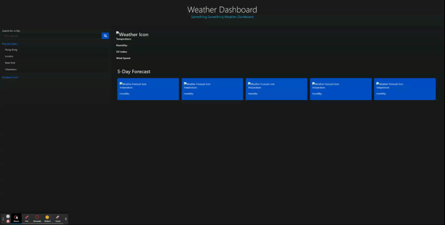

# WeatherDashboard-WebApp

## Table of Contents
* [Description](#description)
* [Usage](#usage)
* [Contact](#contact)

## Description
* 

* The weather dashboard application provided the user the ability to get data on a desired city. It uses the openweatherAPI to get data like temperature, humidity, UV index, wind speed, and weather description. It also will provide a 5 day weather forecast for the upcoming weather. Upon a successful  search the City searched will be added to local storage and also populate a clickable search button in the search bar under "user cities"

## Usage
* Enter a city and press the search button to search
* City weather data will populate the weather dashboard
* Forecast data will populate in forecast below current weatherEl
* 

## Contact
email: zachholloway.n@gmail.com
github: Zach-EE

